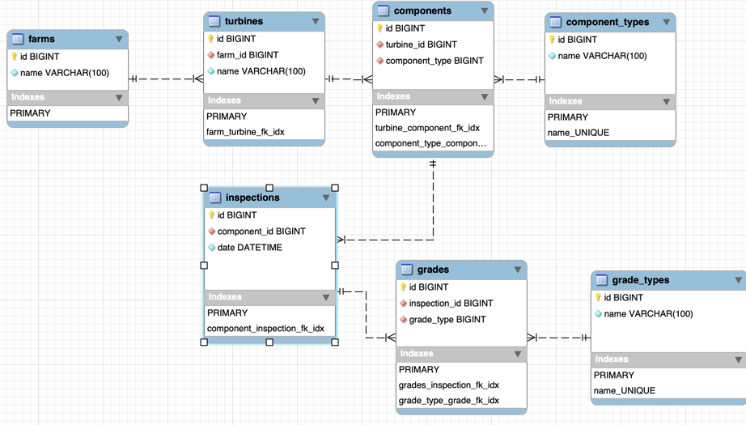

## About Software Development @ Cyberhawk


## The task
We've designed this task to try and give you the ability to show us what you can do and hopefully flex your technical and creative muscles. You can't show off too much here, show us you at your best and wow us!

To make things as simple as we could, we've opted to use [Laravel Sail](https://laravel.com/docs/8.x/sail) to provide a quick and convenient development environment, this will require you to install
[Docker Desktop](https://www.docker.com/products/docker-desktop) before you can start the test. We've provided [some more detailed instructions](#setting-everything-up) below in case this is your first time using Docker or Sail.

We'd like you to build an application that will display an example wind farm, its turbines and their components.
We'd like to be able to see components and their grades (measurement of damage/wear) ranging between 1 - 5.

For example, a turbine could contain the following components:
- Blade
- Rotor
- Hub
- Generator

Don't worry about using real names for components or accurate looking data, we're more interested in how you structure the application and how you present the data.

Don't be afraid of submitting incomplete code or code that isn't quite doing what you would like, just like your maths teacher, we like to see your working.
Just Document what you had hoped to achieve and your thoughts behind any unfinished code, so that we know what your plan was.

### Requirements
- Each Turbine should have a number of components
- A component can be given a grade from 1 to 5 (1 being perfect and 5 being completely broken/missing)
- Use Laravel Models to represent the Entities in the task.
- Conform to the spec provided in the `api-spec.yaml` file in the root of this project.
    - If your API matches the spec the provided pre-built front-end should be able to display the data provided via your API

### Bonus Points
- Automated tests
- API Authentication
- API Authorization
- Use of coding style guidelines (we use PSR-12 and AirBnb)
- Use of git with clear logical commits
- Specs/Plans/Designs

### Submitting The Task
We're not too fussy about how you submit the task, providing it gets to us and we're able to run it we'll be happy however here are some of the ways we commonly see:
- Fork this repo, work and add us as a collaborator on your GitHub repo and send us a link
- ZIP the project and email it to us at andy.rayne@thecyberhawk.com / joe.ware@thecyberhawk.com

## Setting Everything Up
As mentioned above we have chosen to make use of Laravel Sail as the foundation of this technical test.
- If you haven't already, you will need to install [Docker Desktop](https://www.docker.com/products/docker-desktop).
- One that is installed your next step is to install this projects composer dependencies (including Sail).
    - This will require either PHP 8 installed on your local machine or the use of [a small docker container](https://laravel.com/docs/8.x/sail#installing-composer-dependencies-for-existing-projects) that runs PHP 8 that can install the dependencies for us.
- If you haven't done so already copy the `.env.example` file to `.env`
    - If you are running a local development environment you may need to change some default ports in the `.env` file
        - We've already changed mysql to 33060 and NGINX to 81 for you
- It should now be time to [start Sail](https://laravel.com/docs/8.x/sail#starting-and-stopping-sail) and the task
- There is a file in the root of this project called `api-spec.yaml` this can be imported into your application of choice to ensure you're building your application to the spec that we're expecting. Some notable applications are:
  - Postman
  - Swagger
  - StopLight


### Installing Composer Dependencies
https://laravel.com/docs/9.x/sail#installing-composer-dependencies-for-existing-projects
```bash
docker run --rm \
-u "$(id -u):$(id -g)" \
-v $(pwd):/var/www/html \
-w /var/www/html \
laravelsail/php81-composer:latest \
composer install --ignore-platform-reqs
```

### Quick Tips
- Don't run npm/composer from your host, always run it via the sail command
  - This is because the docker container may not be able to write to the filesystem after you do so
- Ensure you have a valid .env file before starting sail for the first time.
  - Sail creates a docker volume which is persistent, so stopping/starting sail will not affect/fix issues in a volume (missing DB etc)

## Your Notes
I'm going to add authentication at the end if i have enough time, as I'd rather do more of the endpoints/tests. I plan on using Laravel Sanctum.

### Planning the models
Lets break down the task a little bit to find some domains for our project.

We'd like you to build an application that will display an example <b>wind farm</b>, its <b>turbines</b> and their <b>components</b>. We'd like to be able to see components and their <b>grades</b> (measurement of damage/wear) ranging between 1 - 5.

So after reading the task we have the following models:

- Wind Farms
- Turbines
- Components
- Grades

There can multiple examinations to grade the components, so we need to add another model for this. As I've already read the API spec, we're going to call it inspections.

So after reading the task we have our required models:

- Farms <sup>* Changed due to API spec, I'd have called it Wind Farms</sup>
- Turbines
- Components
- Inspections
- Grades

#### Relationship mapping

I've created a EER map to show my planned relationships. 
- I've added component type and grade type as it's in the API sepc.
    - This makes sense to allow for ease of update for component name, and doesn't tie grade to only numeric measurement for the future.



I've mapped this in a way so each component has it's own inspection, that way the user doesn't have to inspect all components on the same day.

### Planning the endpoints

As we've already got the API spec, this is mostly done for us.
We can however map the endpoint to the controllers/actions, although looking at the endpoints it looks pretty obvious.

`/farms` -> `FarmController::index`

`/farms/{farmId}` -> `FarmController::show`

`/farms/{farmId}/turbines` -> `TurbineController::index`

`/farms/{farmId}/turbines/{turbineId}` -> `TurbineController::show`

`/turbines` -> `TurbineController::index`

`/turbines/{turbineId}` -> `TurbineController::show`

`/turbines/{turbineId}/components` -> `ComponentController::index`

`/turbines/{turbineId}/components/{componentId}` -> `ComponentController::show`

`/turbines/inspections` -> `InspectionController::index`

`/turbines/inspections/{inspectionId}` -> `InspectionController::show`

`/components` -> `ComponentController::index`

`/components/{componentId}` -> `ComponentController::show`

`/components/{componentId}/grades` -> `GradeController::index`

`/components/{componentId}/grades/{gradeId}` -> `GradeController::show`

`/inspections` -> `InspectionController::index`

`/inspections/{inspectionId}` -> `InspectionController::show`

`/inspections/{inspectionId}/grades` -> `GradeController::index`

`/inspections/{inspectionId}/grades/{gradeId}` -> `GradeController::show`

`/grades` -> `GradeController::index`

`/grades/{gradeId}` -> `GradeController::show`

`/component-type` -> `ComponentTypeController::index`

`/component-type/{componentTypeId}` -> `ComponentTypeController::show`

`/grade-type` -> `GradeTypeController::index`

`/grade-type/{gradeTypeId}` -> `GradeTypeController::show`


## Summary
I've cut the project short due to time, and I feel most of the other endpoints won't show anything extra.

To seed run:
`./vendor/bin/sail artisan migrate:fresh --seed`

Once seeded, get a token:
`./vendor/bin/sail artisan tinker --execute "dd(\App\Models\User::find(1)->createToken('api', ['*'], now()->addWeek())->plainTextToken);"`

Make sure your requests have the following headers:
- Accept: application/json
- Referer: http://localhost
- Authorization: Bearer <token>

To run swagger api generation:
`./vendor/bin/sail artisan l5-swagger:generate`

To preview the docs, visit:
http://localhost:80/api/documentation

To run psalm:
`./vendor/bin/sail bin psalm`
